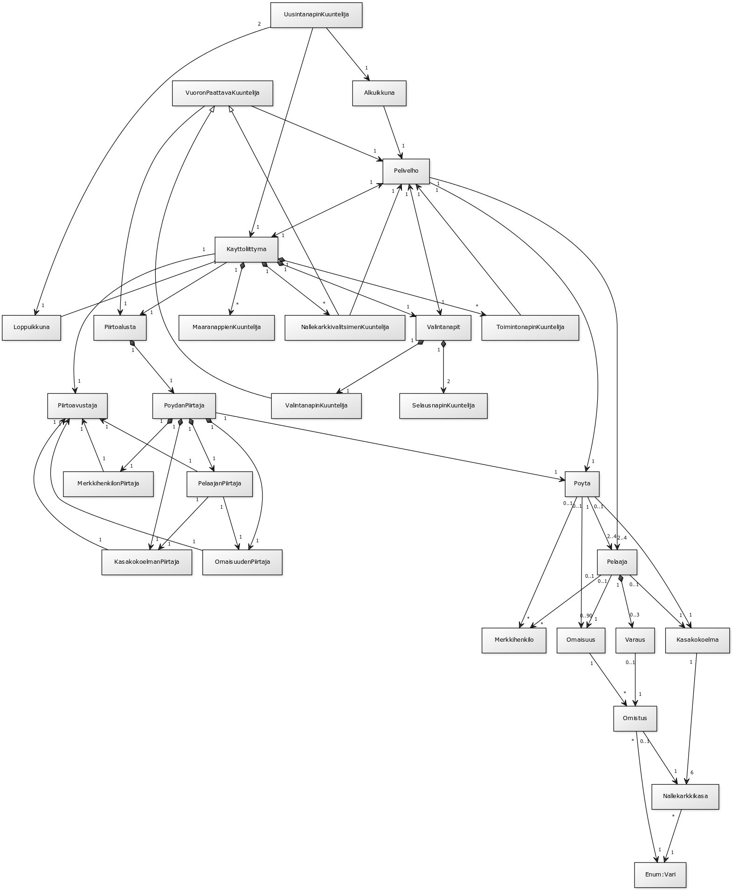
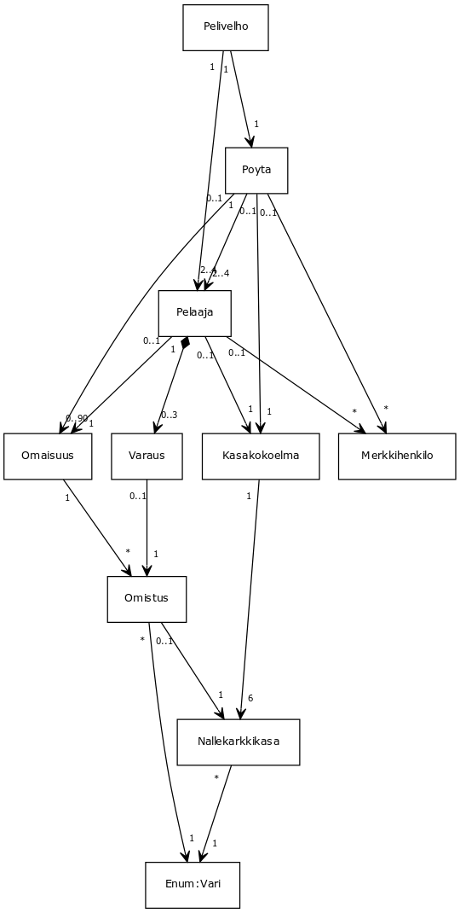
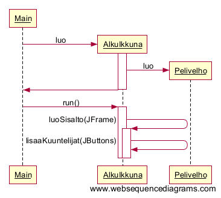
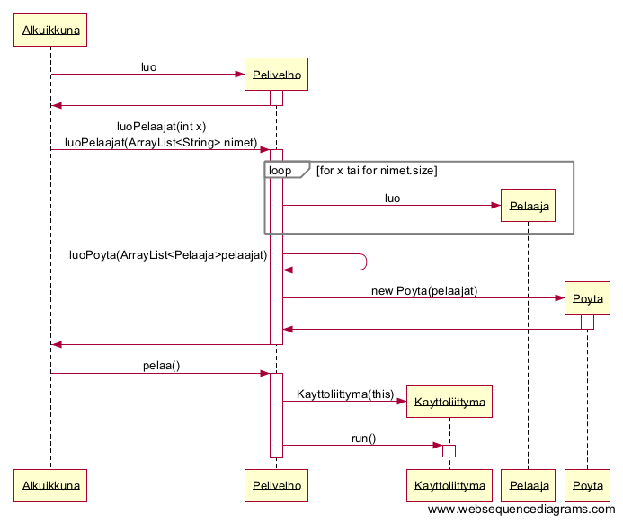

*xvixvi ylpeänä(?) esittää:*

#Kiilto

**Aihe:** Kiilto on peli, jossa on 2-4 pelaajaa. Pelaajat pyrkivät keräämään 15 arvovaltapistettä voittaakseen. Pisteitä saa omaisuudesta sekä "viettelemistään" merkkihenkilöistä.

Omaisuutta voi ostaa nallekarkeilla, joita pelaaja voi vuorollaan (tiettyjen sääntöjen rajoissa) ottaa. Omaisuutta voi myös varata ostamatta sitä. Ostettu omaisuus tuottaa pelaajalle nallekarkkeja, mikä helpottaa tulevia ostoja. Tarpeeksi suuri ja monipuolinen omaisuus viettelee merkkihenkilön, joka antaa pelaajalle (yö)vierailullaan lisää pisteitä.

**Käyttäjät:** Pelaaja(t)

**Pelaajan toiminnot:**

* Alustaa pelin
  * valitsee pelaajien määrän
  * syöttää pelaajien nimet //wip
  * aloittaa pelin

* Pelaa vuoronsa, eli joko
  1. nostaa nallekarkkeja
    1. kaksi samanväristä
      * vain jos väriä on tarjolla >= 4kpl
    2. kolme eriväristä, yhden kutakin väriä
  2. ostaa omaisuutta
    1. pöydästä
      * jos karkit ja omaisuus riittävät
    2. varauksistaan
      * jos varauksia on
      * jos karkit ja omaisuus riittävät
  3. varaa omaisuutta pöydästä ja saa yhden kultaisen nallekarkin
    * max kolme yhtäaikaista varausta per pelaaja
    * saa kultaisen nallekarkin vain, jos niitä on tarjolla
 
Pelin loputtua pelaaja voi
* aloittaa uuden pelin tai
* sulkea ohjelman.

##Säännöt

[Säännöt](saannot.md)

##Testauksesta

Katso tämä [dokumentti ohjelman testaamisesta](testaus.md).

##Ohjelman rakenne

* Pelin pyörittämisen neljä tärkeintä solmukohtaa (katso [kuva 1](#kuva 1)): 
 * Pelivelho, joka toimii rajapintana käyttöliittymän ja pelilogiikan välillä
 * Käyttöliittymä, joka sisältää Piirtoalustan sekä toimii rajapintana käyttäjän ja pelilogiikan välillä
 * Alkuikkuna, jonka avulla käyttäjä alustaa pelin
 * Loppuikkuna, joka sulkee vanhan käyttöliittymän ja avaa uuden Alkuikkunan
* Graafisen esityksen kannalta tärkeimmät solmukohdat ovat
 * Piirtoalusta ja PöydänPiirtäjä, jotka vastaavat kaiken pelin sisällön piirtämisestä
 * Käyttöliittymä, joka pitää sisällään graafiset elementit
 
###Pelilogiikka

Kiillon pelilogiikka on hyvin suoraviivainen: Pelivelho käskee ja muut toteuttavat. Katso [kuva 2](#kuva 2).

###Käyttöliittymä

Pelissä esiintyy kolme ikkunaa, jotka kukin vastaavat itse itsestään omina luokkinaan:
* Alkuikkuna
* Kayttoliittyma
* Loppuikkuna

Kaikki käyttöliittymät on toteutettu Swingillä omin pikku kätösin, minkä vuoksi jälki on vähintäänkin rumaa. Koodi on kuitenkin luettavanpaa (kuin autogeneroidulla käyttöliittymällä olisi ollut) ja toiminnankuuntelijat ovat (toivottavasti) selkeästi nimetyt. Tämän pitäisi mahdollistaa ohjelman jatkokehitys (jos joku ikinä jaksaisi).

Käyttöliittymästä pitää mainita vielä omituisuus Valintanapit: luokka vastaa ostettavien (tai varattavien) omaisuuksien (ja varausten) selaamisesta ja valitsemisesta, ja joutuu tämän vuoksi keskustelemaan suoraan Pelivelhon kanssa. Valintanapit siis hakevat Pelivelholta tiedon esillä olevista omistuksista (ja varauksista) ja käyttävät saatuja nimiä selaustoiminnon perustana. Kun käyttäjä valitsee ostettavan (/varattavan) omistuksen, lähettää valintanapit Pelivelholle tiedon, mikä omistus varataan tai ostetaan (ja onko kyseessä osto vai varaus).

###Piirtäminen

Piirtäminen on askarreltu käsin, ja erotettu täysin pelilogiikasta (toisin kuin esim ohjan matopelissä). Tämä mahdollistaa helpon muokattavuuden, jos joku joskus haluaisi parannella grafiikoita (niissä ei ole kuin parannettavaa).

Käytännössä pelipöytä piirretään kutsumalla piirtoalustaa, joka käskee PoydanPiirtajaa piirtämään pelipöydän. PoydanPiirtajalla on viite Poyta olioon, jolta piirtäjä kyselee kaikki tarvittavat tiedot, jotka delegoi edelleen muille piirtäjille piirrettäväksi.

##Luokkakaaviot

###kuva 1: yksinkertaistettu luokkakaavio koko ohjelmasta

###kuva 2: yksinkertaistettu luokkakaavio pelilogiikasta

##Sekvenssiokaaviot

###kuva 3: sekvenssikaavio: Pelin aloitus ja alkuikkunan luominen

###kuva 4: sekvenssikaavio: Pelivelhon luominen ja käyttöliittymän käynnistäminen

