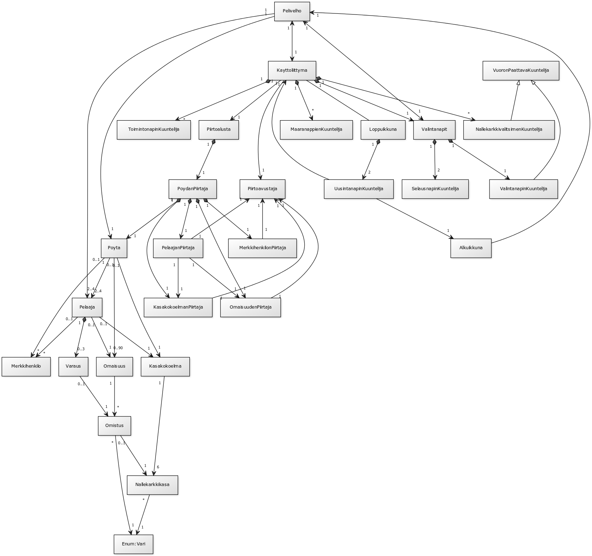

*xvixvi ylpeänä(?) esittää:*

#Kiilto

**Aihe:** Kiilto on peli, jossa on 2-4 pelaajaa. Pelaajat pyrkivät keräämään 15 arvovaltapistettä voittaakseen. Pisteitä saa omaisuudesta sekä "viettelemistään" merkkihenkilöistä.

Omaisuutta voi ostaa nallekarkeilla, joita pelaaja voi vuorollaan (tiettyjen sääntöjen rajoissa) ottaa. Omaisuutta voi myös varata ostamatta sitä. Ostettu omaisuus tuottaa pelaajalle nallekarkkeja, mikä helpottaa tulevia ostoja. Tarpeeksi suuri ja monipuolinen omaisuus viettelee merkkihenkilön, joka antaa pelaajalle (yö)vierailullaan lisää pisteitä.

**Käyttäjät:** Pelaaja(t)

**Pelaajan toiminnot:**

* Alustaa pelin
  * valitsee pelaajien määrän
  * syöttää pelaajien nimet //wip
  * aloittaa pelin

* Pelaa vuoronsa, eli joko
  1. nostaa nallekarkkeja
    1. kaksi samanväristä
      * vain jos väriä on tarjolla >= 4kpl
    2. kolme eriväristä, yhden kutakin väriä
  2. ostaa omaisuutta
    1. pöydästä
      * jos karkit ja omaisuus riittävät
    2. varauksistaan
      * jos varauksia on
      * jos karkit ja omaisuus riittävät
  3. varaa omaisuutta pöydästä ja saa yhden kultaisen nallekarkin
    * max kolme yhtäaikaista varausta per pelaaja
    * saa kultaisen nallekarkin vain, jos niitä on tarjolla

##Säännöt

[Säännöt](saannot.md)

##Ohjelman rakenne

* Pelin pyörittämisen neljä tärkeintä solmukohtaa (katso [kuva 1](#kuva 1)): 
 * Pelivelho, joka toimii rajapintana käyttöliittymän ja pelilogiikan välillä
 * Käyttöliittymä, joka sisältää Piirtoalustan sekä toimii rajapintana käyttäjän ja pelilogiikan välillä
 * Alkuikkuna, jonka avulla käyttäjä alustaa pelin
 * Loppuikkuna, joka sulkee vanhan käyttöliittymän ja avaa uuden Alkuikkunan
* Graafisen esityksen kannalta tärkeimmät solmukohdat ovat
 * Piirtoalusta ja PöydänPiirtäjä, jotka vastaavat kaiken pelin sisällön piirtämisestä
 * Käyttöliittymä, joka pitää sisällään graafiset elementit

##Luokkakaaviot

###kuva 1: yksinkertaistettu luokkakaavio koko ohjelmasta

###kuva 2: yksinkertaistettu luokkakaavio pelilogiikasta

##Sekvenssiokaaviot

###kuva 3: sekvenssikaavio: Pelin aloitus ja alkuikkunan luominen

###kuva 4: sekvenssikaavio: Pelivelhon luominen ja käyttöliittymän käynnistäminen

